<p align="center">
  
</p>

<h1 align="center">Manual de usuario</h1>
<p align="center"><b>Distribuidor de Suplementos (YOWI)</b> — tienda en línea y panel de administración</p>

> Última actualización: 2026-08-03 · Este manual cubre **toda la tienda**: lo que ve y usa el cliente, y lo que puedes hacer tú desde el panel de administrador.

---

## Cómo usar este manual

Está dividido en tres partes:

1. **Parte 1 — Guía del cliente**: cada página que ve un visitante o comprador de la tienda.
2. **Parte 2 — Guía del administrador**: cada página del panel `/admin`.
3. **Parte 3 — Seguridad**: cómo proteger tu cuenta de administrador con verificación en dos pasos.

Cada sección tiene: qué es la página, una o más capturas de pantalla reales, y — cuando aplica — un diagrama con el flujo paso a paso. Al final hay un **Apéndice** con la paleta de colores de la marca y un glosario de términos.

**Convención de avisos usada en todo el manual:**

> ⚠️ **Cuidado** — una acción que no se puede deshacer o que afecta a toda la tienda.

> ℹ️ **Nota** — una aclaración importante para no llevarte una sorpresa.

---

# 🛒 Parte 1 — Guía del cliente

## Mapa de la tienda pública

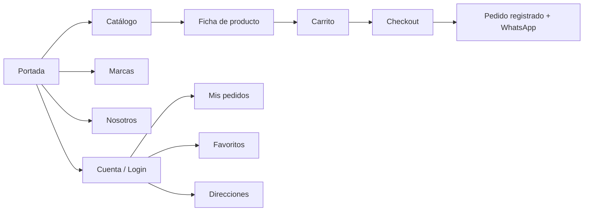
```mermaid
flowchart LR
    A[Portada] --> B[Catálogo]
    B --> C[Ficha de producto]
    C --> D[Carrito]
    D --> E[Checkout]
    E --> F[Pedido registrado + WhatsApp]
    A --> G[Marcas]
    A --> H[Nosotros]
    A --> I[Cuenta / Login]
    I --> J[Mis pedidos]
    I --> K[Favoritos]
    I --> L[Direcciones]
```

## Portada (`index.html`)

La primera pantalla que ve cualquier visitante.

- **Carrusel de promociones**: rota solo cada pocos segundos, mostrando las imágenes que suba el administrador. Si no hay ninguna cargada, muestra una portada por defecto — nunca se ve vacía.
- **Franja de confianza**: envío garantizado, pagos seguros, productos originales, atención por WhatsApp.
- **Productos destacados** y accesos directos al catálogo.

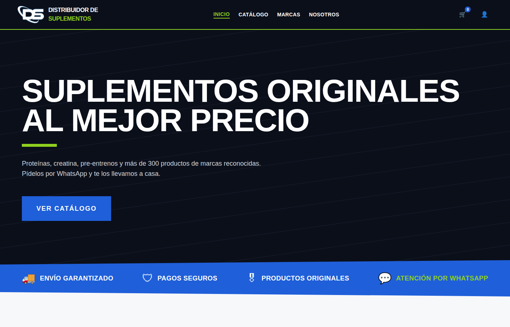

## Catálogo (`catalogo.html`)

El listado completo de productos activos.

- **Buscador inteligente**: tolera errores de escritura. Si buscas "protena" en vez de "proteína", o sin acentos, igual encuentra el producto.
- **Filtros**: por categoría, por marca, por rango de precio, y "solo disponibles" (oculta los agotados).
- **Corazón de favoritos** en cada tarjeta (pide iniciar sesión si no la has iniciado).
- Si un producto tiene **sabores**, la tarjeta muestra **"Desde $X"** cuando los sabores tienen precios distintos, y el botón dice **"Elegir sabor"** en vez de agregar directo — lleva a la ficha para que elijas primero.
- Un producto con sabores solo se ve **"Agotado"** si **todos** sus sabores lo están (no importa si el producto en sí tiene o no stock propio).

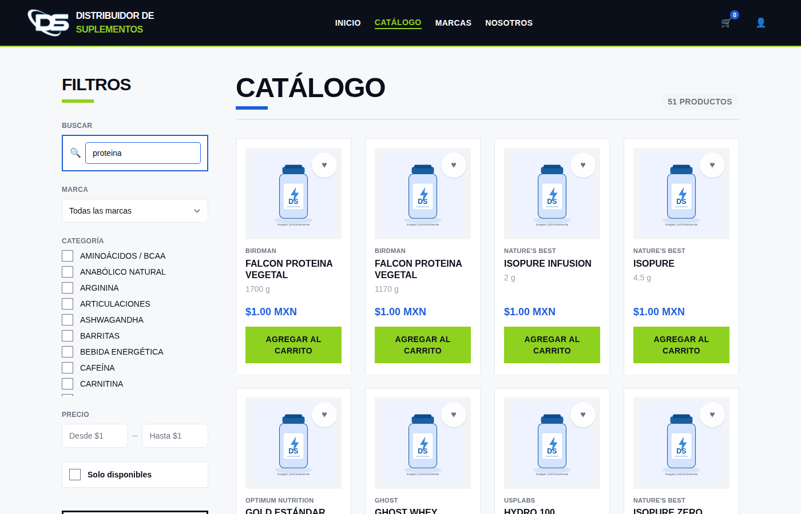

## Ficha de producto (`producto.html`)

Toda la información de un producto y el punto donde se agrega al carrito.

- **Galería de imágenes**: si el producto tiene fotos adicionales, aparece una tira de miniaturas debajo de la imagen grande. Al pulsar una, la imagen principal cambia. Se puede navegar con el teclado (Tab + Enter). Si el producto solo tiene una imagen, la ficha se ve igual que siempre — sin tira de miniaturas.
- **Sabores** (si el producto los tiene): aparecen como chips (botones redondeados). El sabor agotado se ve tachado y no se puede elegir. Al hacer clic en un sabor:
  - El **precio cambia al instante** en pantalla (usa el precio propio de ese sabor, o si no tiene, el precio del producto).
  - El botón **"Agregar al carrito" se habilita** — antes de elegir un sabor, dice "Elige un sabor" y no se puede usar.
- Marca, presentación (ej. "90 caps"), descripción y precio.

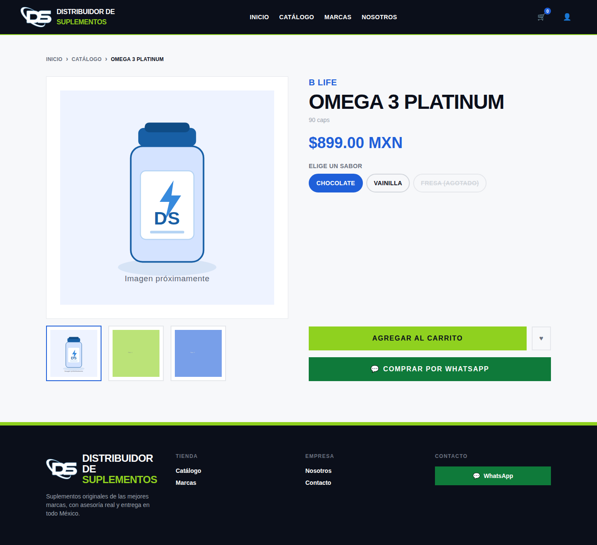

### Flujo: elegir producto y sabor

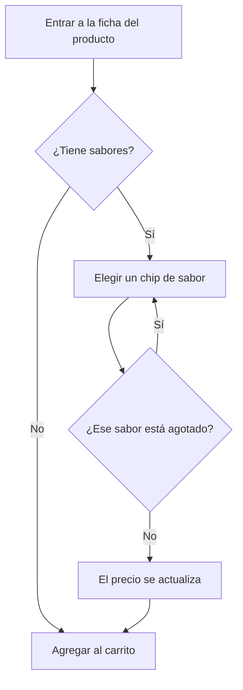
```mermaid
flowchart TD
    A[Entrar a la ficha del producto] --> B{¿Tiene sabores?}
    B -- No --> E[Agregar al carrito]
    B -- Sí --> C[Elegir un chip de sabor]
    C --> D{¿Ese sabor está agotado?}
    D -- Sí --> C
    D -- No --> F[El precio se actualiza]
    F --> E
```

## Marcas (`marcas.html`)

Directorio de todas las marcas que maneja la tienda, con buscador y filtro alfabético (A-Z).

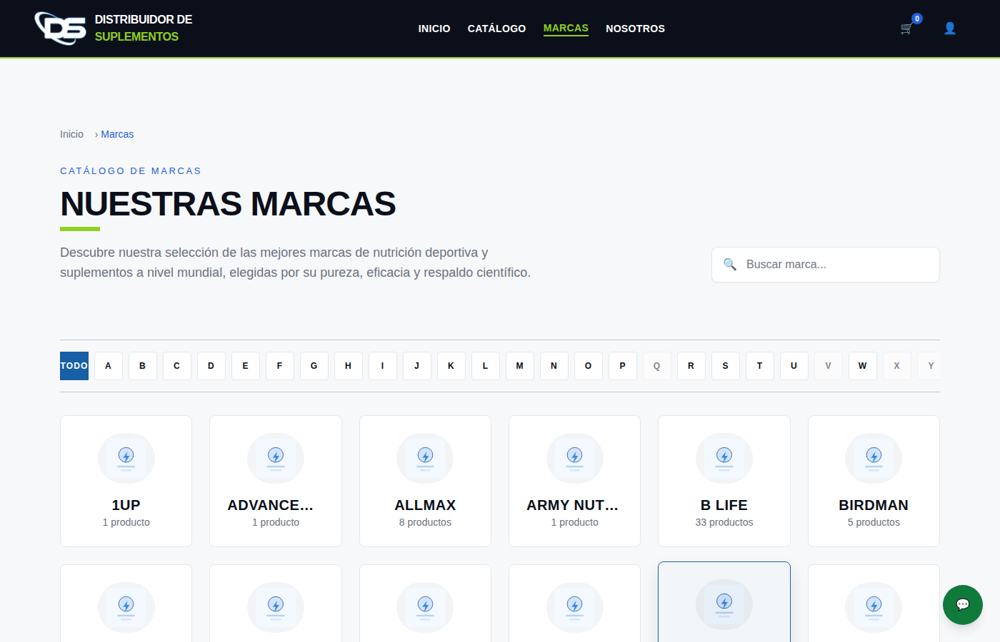

## Nosotros (`nosotros.html`)

Información de la tienda (misión, historia, ubicación) y un formulario de **Contacto**.

> ℹ️ **Nota** — el formulario de contacto **no envía un correo electrónico**. Arma un mensaje con lo que escribiste y **abre WhatsApp** para que lo envíes desde ahí. Es la misma vía que el botón directo "Escríbenos por WhatsApp".

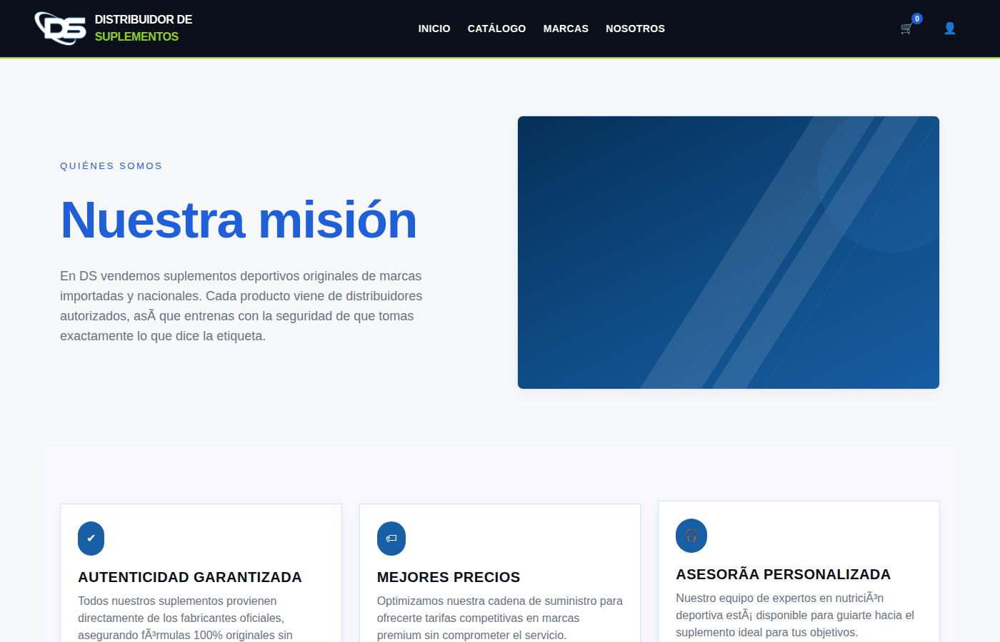

## Carrito y checkout (`pedido.html`)

Donde el cliente revisa lo que va a comprar y confirma sus datos de entrega.

- El carrito se guarda en el propio navegador (no se pierde si recargas la página), y no requiere haber iniciado sesión para usarlo.
- **Un producto con dos sabores distintos aparece en DOS líneas separadas** del carrito, cada una con su propia cantidad y su propio precio — así conviven, por ejemplo, "Chocolate" y "Vainilla" del mismo producto sin mezclarse.
- Puedes subir/bajar la cantidad o eliminar cualquier línea con los botones **− / + / 🗑**.
- **Datos de envío**: nombre, teléfono, calle, colonia, código postal, ciudad, estado, referencias y notas.
- Si el cliente tiene **direcciones guardadas** en su cuenta, puede elegir una y el formulario se autocompleta.
- **Pago por transferencia (SPEI)** — se coordina por WhatsApp, no hay pasarela de pago en línea.

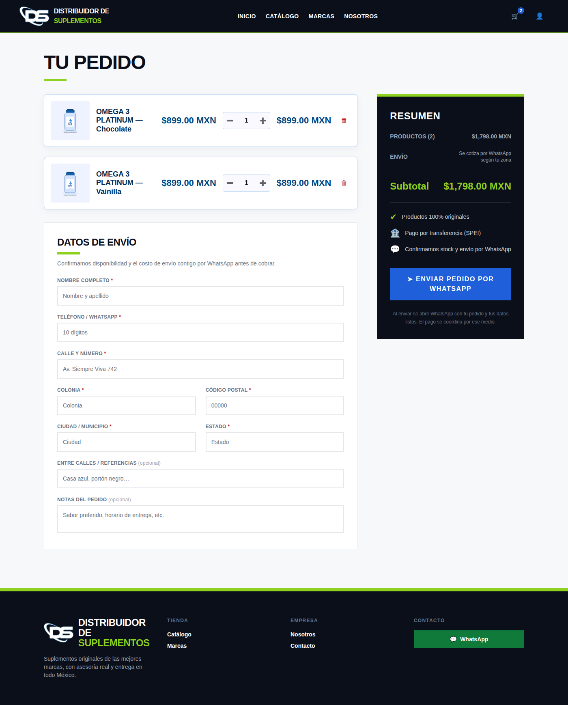

### Flujo: de la ficha al pedido confirmado

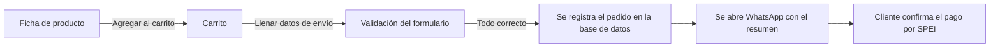
```mermaid
flowchart LR
    A[Ficha de producto] -->|Agregar al carrito| B[Carrito]
    B -->|Llenar datos de envío| C[Validación del formulario]
    C -->|Todo correcto| D[Se registra el pedido en la base de datos]
    D --> E[Se abre WhatsApp con el resumen]
    E --> F[Cliente confirma el pago por SPEI]
```

> ℹ️ **Nota de seguridad** — el precio y el descuento de inventario **siempre se calculan en el servidor**, nunca con lo que manda el navegador del cliente. Aunque alguien manipule la página, no puede pagar menos de lo real ni comprar algo agotado.

## Cuenta de cliente

### Registro (`registro.html`) y login (`login.html`)

Alta con nombre, correo, teléfono y contraseña (con confirmación). El login acepta "recordarme" y tiene un enlace para recuperar la contraseña.

<table><tr>
<td>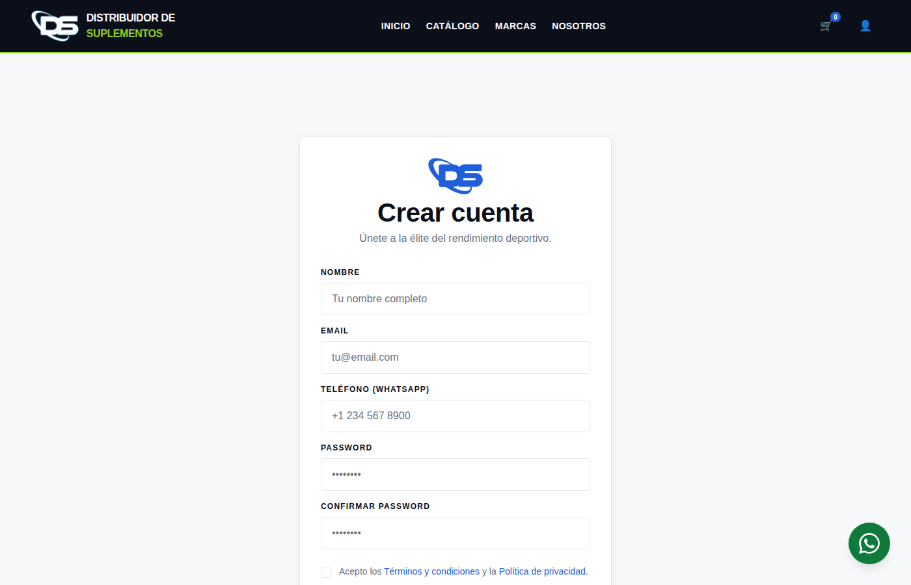</td>
<td>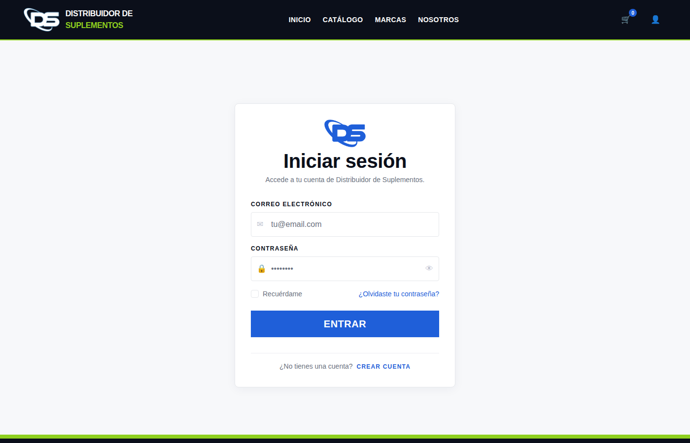</td>
</tr></table>

### Recuperar contraseña (`recuperar.html` → `restablecer.html`)

Un flujo de dos páginas, por si el cliente olvida su contraseña:

1. En `recuperar.html` escribe su correo y pide el enlace.
2. Le llega un correo con un enlace único que lo lleva a `restablecer.html`.
3. Ahí escribe su nueva contraseña (con confirmación) y queda lista para iniciar sesión.

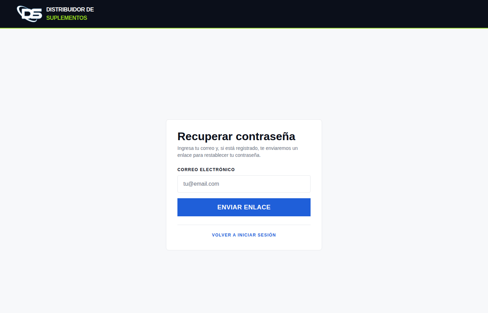

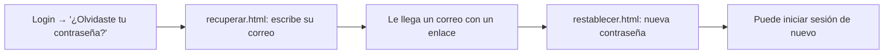
```mermaid
flowchart LR
    A["Login → '¿Olvidaste tu contraseña?'"] --> B[recuperar.html: escribe su correo]
    B --> C[Le llega un correo con un enlace]
    C --> D[restablecer.html: nueva contraseña]
    D --> E[Puede iniciar sesión de nuevo]
```

### Mi cuenta (`cuenta.html`)

Panel del cliente con 4 pestañas:

| Pestaña | Qué hace |
|---|---|
| **Mis datos** | Editar nombre y teléfono. |
| **Mis pedidos** | Ver el historial: folio, fecha, total, estado, y el sabor de cada producto si aplica. |
| **Favoritos** | Los productos marcados con el corazón — se puede agregar al carrito directo desde aquí. |
| **Direcciones** | Guardar varias direcciones de envío, marcar una como predeterminada, editar o eliminar. Se usan para autocompletar el checkout. |

<table><tr>
<td>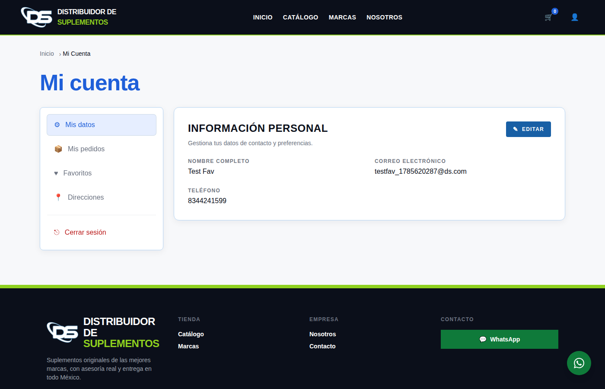</td>
<td>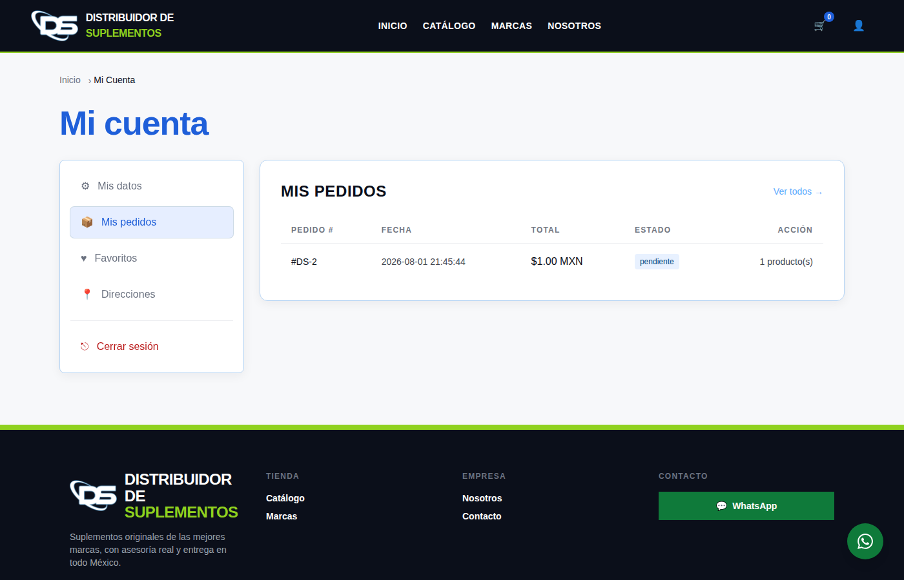</td>
</tr><tr>
<td>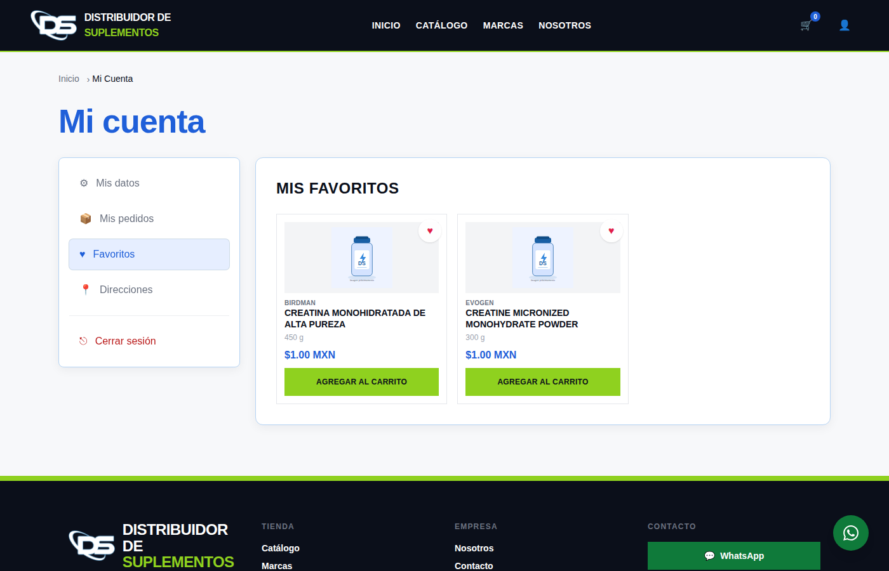</td>
<td>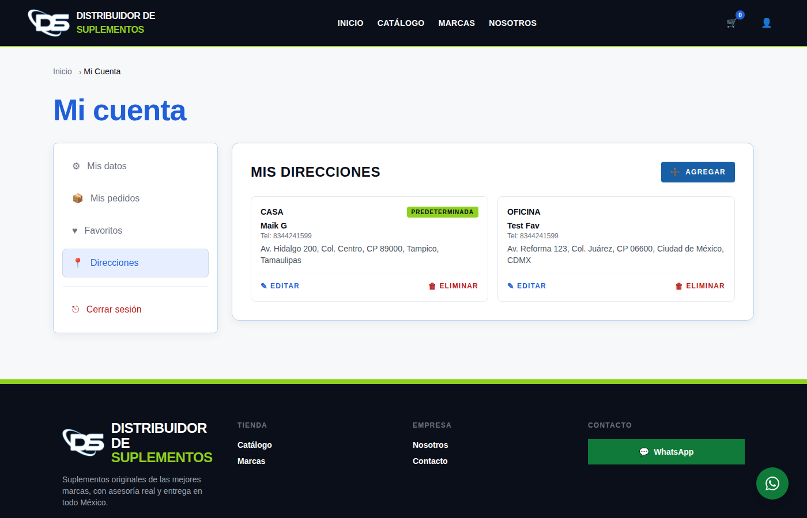</td>
</tr></table>

---

# 🔐 Parte 2 — Guía del administrador

Se entra en `admin/login.html` con tu correo y contraseña. Todo el panel exige sesión de administrador — si no la tienes, no se puede ver ni tocar nada.

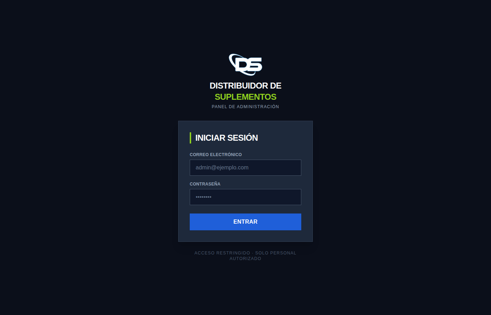

## Mapa del panel

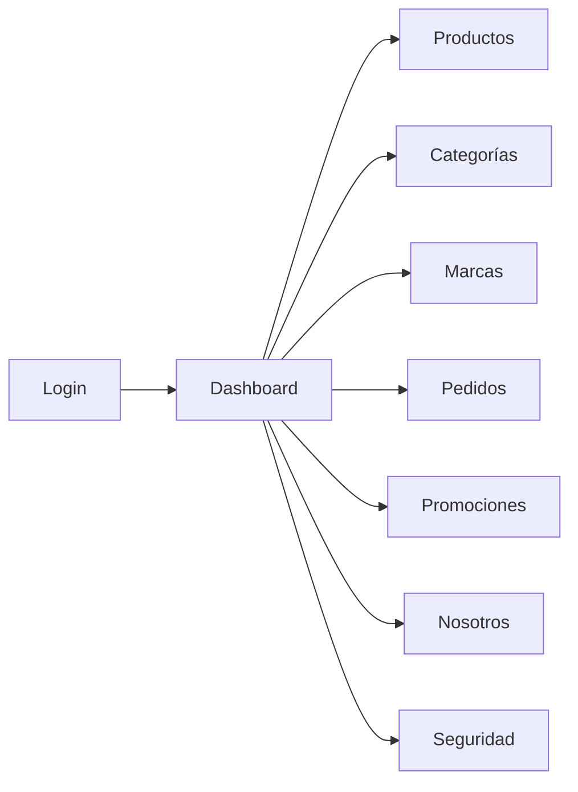
```mermaid
flowchart LR
    Login --> Dashboard
    Dashboard --> Productos
    Dashboard --> Categorias[Categorías]
    Dashboard --> Marcas
    Dashboard --> Pedidos
    Dashboard --> Promociones
    Dashboard --> Nosotros
    Dashboard --> Seguridad
```

## Dashboard (`admin/index.html`)

La primera pantalla al entrar: un vistazo rápido de la tienda.

- **4 tarjetas de métricas**: total de productos, total de categorías, total de pedidos, y pedidos pendientes por atender.
- **Últimos pedidos**: los 5 más recientes con cliente, total, estado y fecha.
- **Tarjeta "Respaldo completo"**: descarga o restaura de un solo archivo todas las secciones de la tienda (ver [Respaldos](#respaldos-botón-respaldar--restaurar-en-cada-sección)).

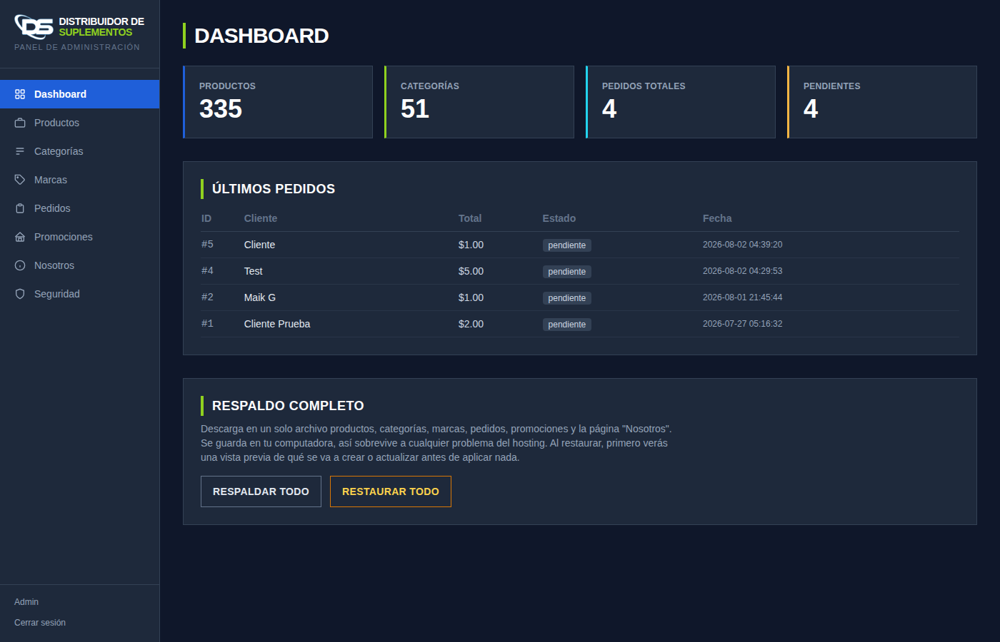

## Productos (`admin/productos.html`)

La sección más completa del panel.

- **Tabla** con imagen, nombre, marca, categoría, SKU, precio, stock, si está destacado y si está visible — con buscador (nombre, marca o SKU) y filtro por categoría.
- **Crear / Editar producto**: nombre, marca, categoría, SKU (opcional), presentación, descripción, precio, precio original (tachado), stock, imagen principal, badge, destacado y visible.

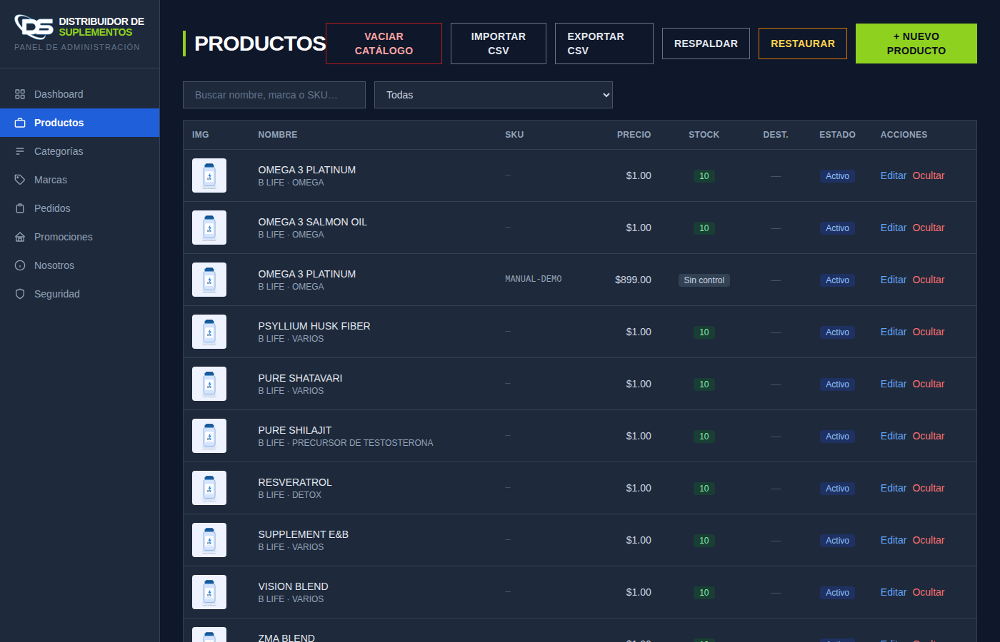

### Sabores y galería (dentro del modal de producto)

Estas dos secciones aparecen **solo al editar** un producto que ya existe — un producto nuevo primero se debe guardar una vez (necesita su propio id) antes de poder agregarle sabores o fotos de galería.

- **Sabores**: filas con nombre + stock propio + precio propio. Ambos son opcionales:
  - Stock vacío = **sin control de inventario** (siempre disponible).
  - Precio vacío = **usa el precio del producto**.
  - Se guardan junto con el botón "Guardar" del formulario.
- **Galería de imágenes**: sube varias fotos además de la principal. Se suben al instante (no hace falta guardar el formulario). Se pueden reordenar con las flechas ◀ ▶, quitar con ✕, o marcar cualquiera como la nueva imagen principal con ★.

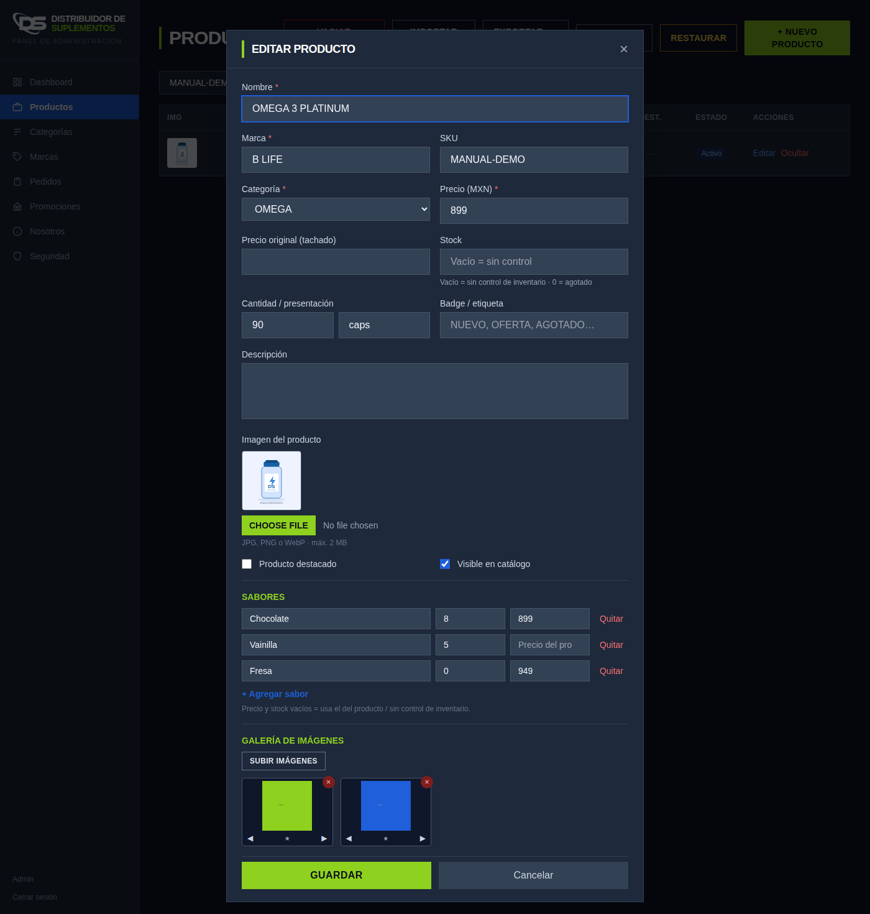

### Importar productos por CSV (con vista previa)

La forma de cargar o actualizar muchos productos a la vez desde Excel o Google Sheets.

1. Botón **"Importar CSV"** → elige tu archivo (o descarga la plantilla de ejemplo primero).
2. Botón **"Analizar"**: procesa el archivo y muestra una tabla fila por fila — **sin guardar nada todavía**:
   - 🟩 **Nuevo** — se va a crear.
   - 🟦 **Cambia** — ya existe y algún dato es distinto (se listan los campos).
   - ⬜ **Sin cambios** — ya existe y es idéntico, no se toca.
   - 🟥 **Omitido** — algo impide procesar esa fila (se explica el motivo).
3. Si todo se ve bien, botón **"Aplicar cambios"** — recién ahí se escribe en la base de datos.

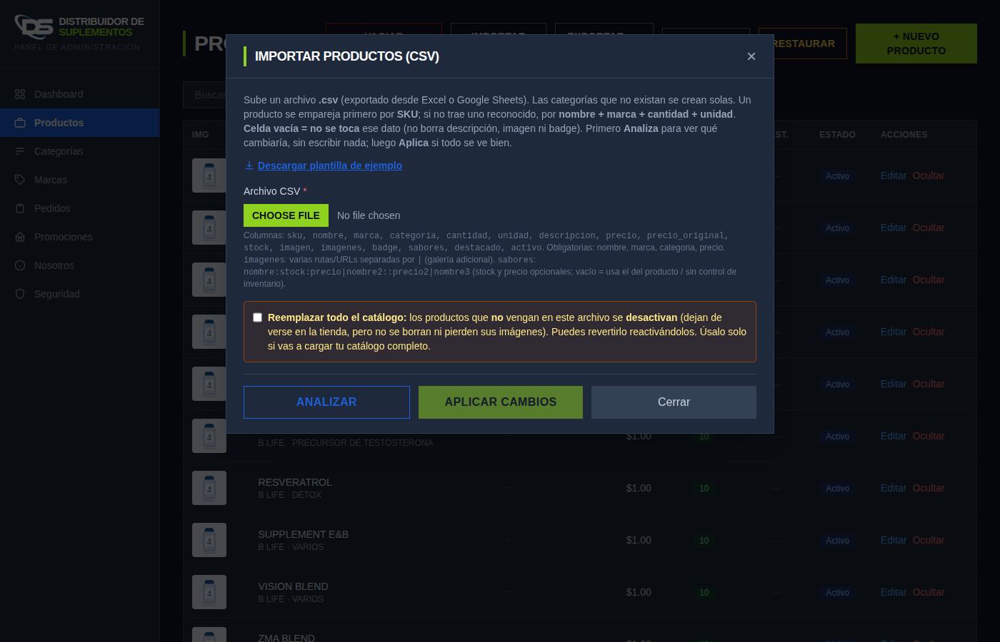
<br><br>
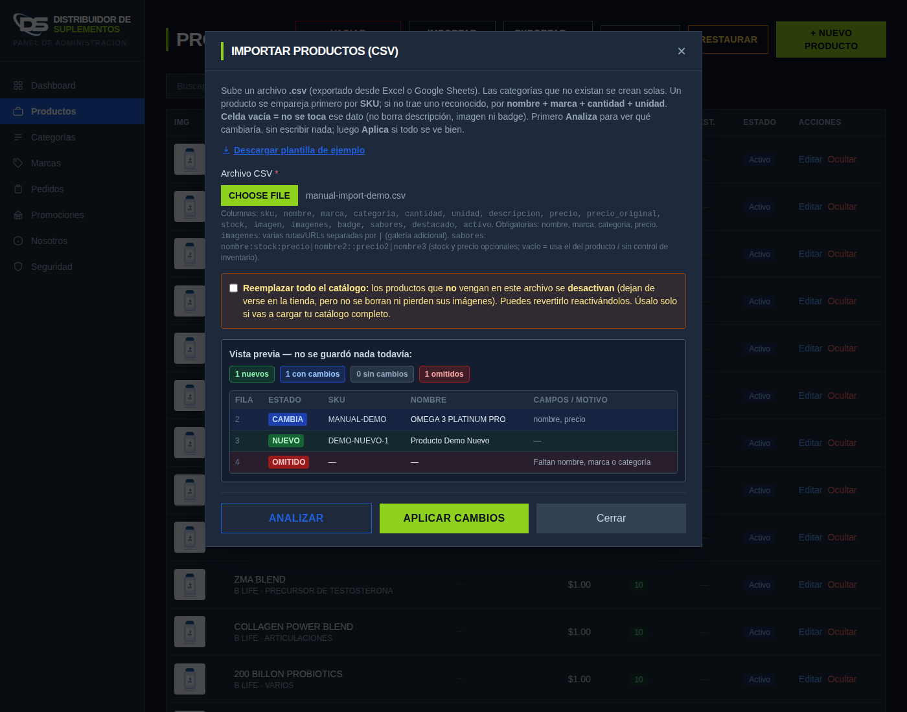

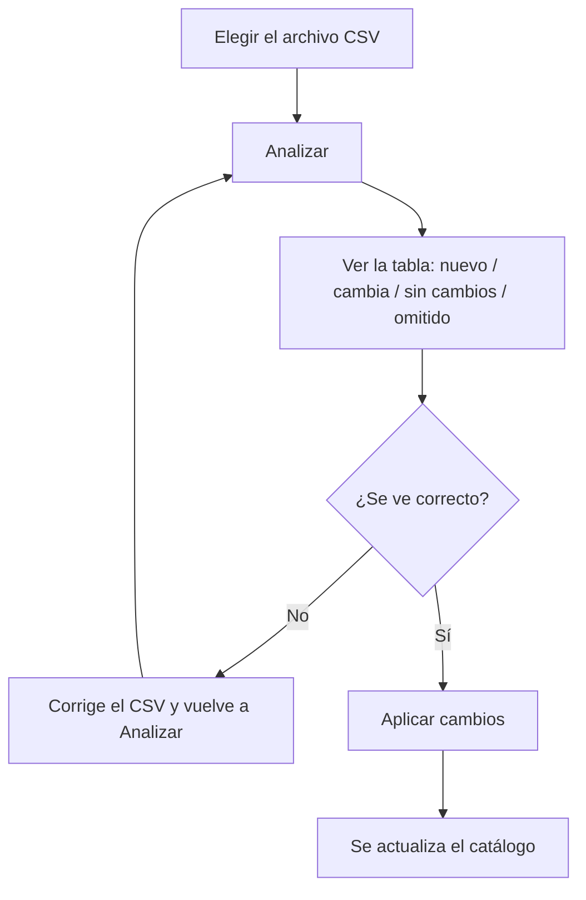
```mermaid
flowchart TD
    A[Elegir el archivo CSV] --> B[Analizar]
    B --> C[Ver la tabla: nuevo / cambia / sin cambios / omitido]
    C --> D{¿Se ve correcto?}
    D -- No --> E[Corrige el CSV y vuelve a Analizar]
    E --> B
    D -- Sí --> F[Aplicar cambios]
    F --> G[Se actualiza el catálogo]
```

**Cómo identifica cada producto:** primero por su **SKU** (si el CSV lo trae y ya existe); si no, por **nombre + marca + cantidad + unidad**. Gracias al SKU puedes corregir una falta de ortografía en el nombre y el importador sabe que es el mismo producto — **no se duplica**.

**Regla de oro:** una celda vacía en el CSV **no borra** ese dato — así reimportar el mismo archivo nunca te hace perder descripciones, imágenes, sabores ni galería por accidente. La única excepción es `stock`: ahí vacío significa explícitamente "sin control de inventario", porque es un valor real, no "no tocar".

**Columnas del CSV** (mismas que trae "Exportar CSV" o la plantilla):

```
sku, nombre, marca, categoria, cantidad, unidad, descripcion, precio,
precio_original, stock, imagen, imagenes, badge, sabores, destacado, activo
```

Obligatorias: `nombre`, `marca`, `categoria`, `precio`.

- `imagenes`: rutas o URLs de la galería, separadas por `|`. Ej.: `assets/img/productos/whey-1.jpg|assets/img/productos/whey-2.jpg`
- `sabores`: `nombre:stock:precio` por sabor, separados por `|` (los dos últimos opcionales). Ej.: `Chocolate:10:899|Mocha::999|Fresa` → Chocolate con 10 piezas a $899; Mocha sin control de inventario a $999; Fresa sin control de inventario, al precio del producto.

**Exportar CSV**: descarga el catálogo completo (con SKU, sabores y galería) en el mismo formato que acepta el importador — útil para editar en Excel y reimportar, o como respaldo rápido.

> ⚠️ **Cuidado — "Reemplazar todo el catálogo"** (checkbox dentro de Importar): los productos que **no** vengan en el archivo se **desactivan** (dejan de verse en la tienda, pero no se borran ni pierden sus fotos — se pueden reactivar). Úsalo solo si estás subiendo tu catálogo completo.

> ⚠️ **Cuidado — "Vaciar catálogo"** (botón junto a "Importar CSV"): borra **todos** los productos, sin posibilidad de deshacer desde el panel. Solo tiene sentido si vas a empezar el catálogo desde cero. Si tienes duda, primero descarga un respaldo (ver más abajo).

## Categorías (`admin/categorias.html`)

Crear, editar y eliminar categorías, con su orden de aparición.

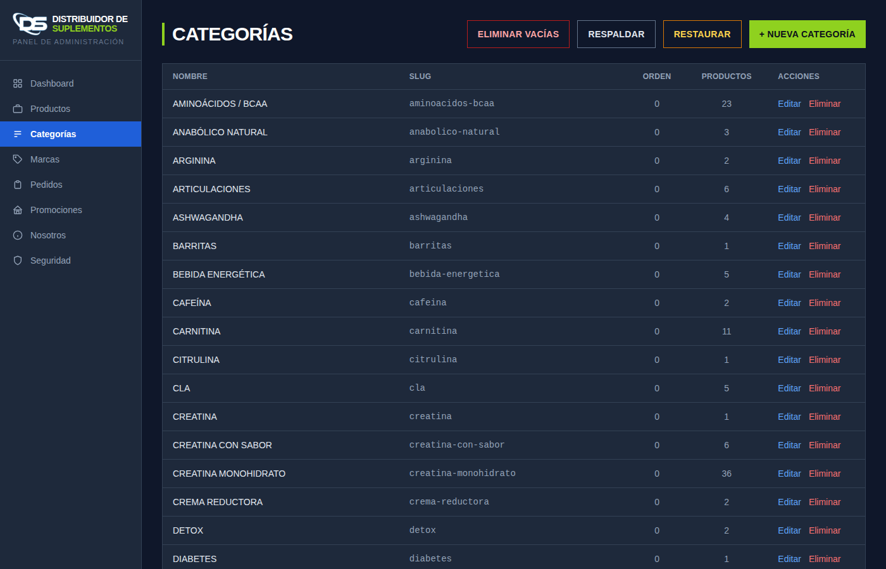

> ⚠️ **Cuidado — "Eliminar vacías"**: borra de un golpe todas las categorías que no tengan ningún producto asignado. No se puede deshacer.

## Marcas (`admin/marcas.html`)

Crear, editar y eliminar marcas, con su logo. También se pueden **importar por CSV**, igual que los productos.

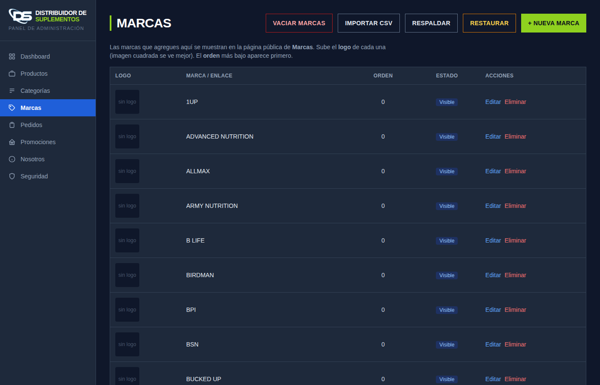

> ⚠️ **Cuidado — "Vaciar marcas"**: borra **todas** las marcas del catálogo, sin deshacer.

## Pedidos (`admin/pedidos.html`)

Todos los pedidos de la tienda, con el sabor de cada línea si aplica. Se puede filtrar por estado y cambiar el estado de cada pedido: `pendiente → confirmado → enviado → entregado`, o `cancelado`.

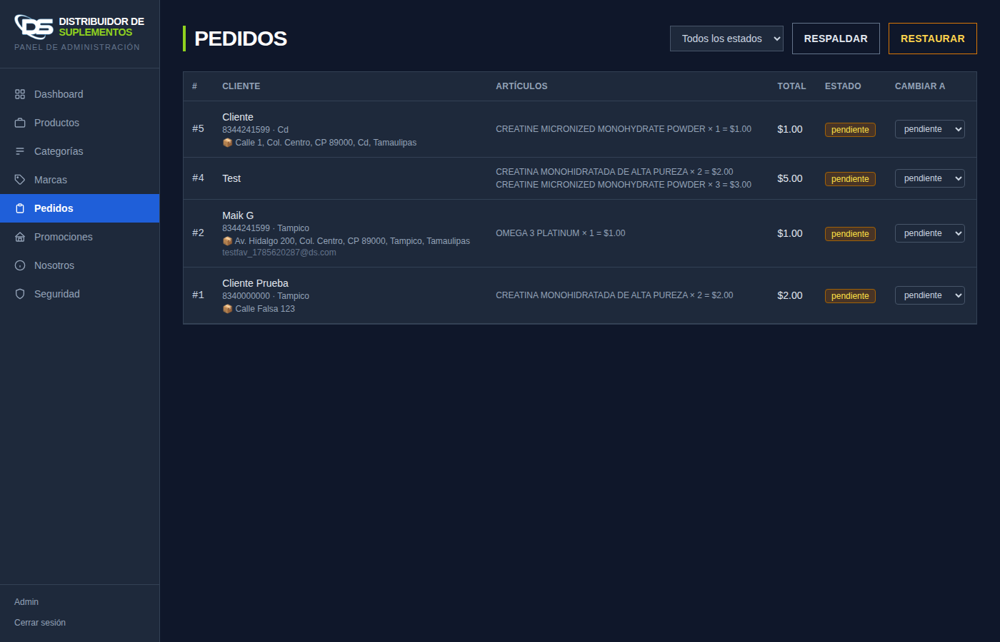

## Promociones / Carrusel (`admin/promociones.html`)

Las imágenes que rotan en el carrusel de la portada. Por cada una: imagen, título (opcional), enlace al hacer clic (opcional), orden y si está visible.

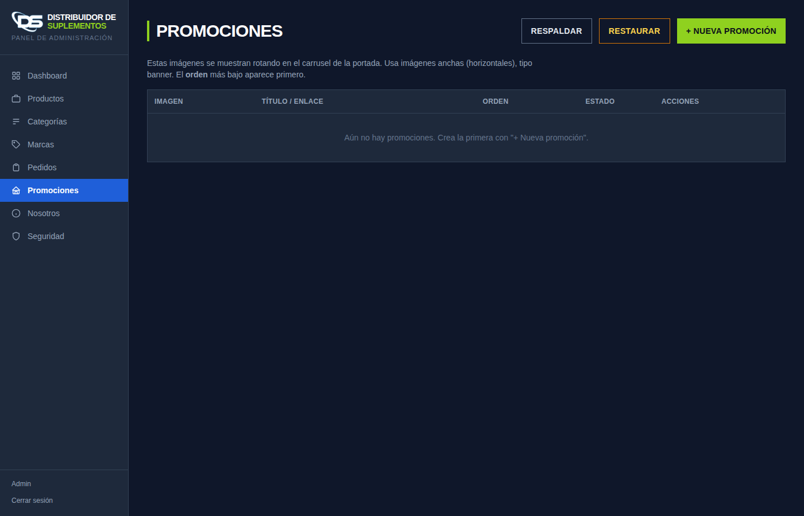

## Nosotros (`admin/nosotros.html`)

Edita el contenido de la página pública "Nosotros" (misión, valores, dirección, teléfono, horario) sin tocar código.

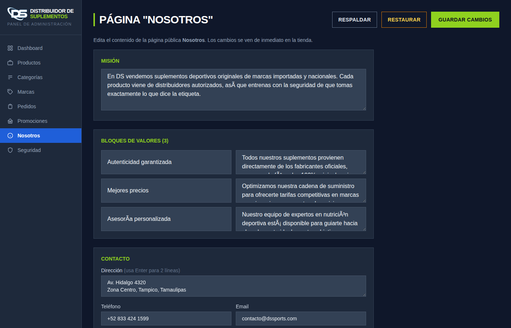

## Respaldos (botón "Respaldar" / "Restaurar" en cada sección)

Presente en las 7 páginas del panel (y como "Respaldo completo" en el Dashboard).

- **Respaldar**: descarga un archivo con fecha de esa sección (productos incluye SKU, sabores y galería).
- **Restaurar**: subes un archivo descargado antes. **Primero muestra una vista previa** de qué se va a crear o actualizar — no se aplica nada hasta que confirmas.
- **Los pedidos nunca se duplican ni se modifican** si ya existen en la base de datos — restaurar jamás altera un pedido real, solo puede crear los que falten.

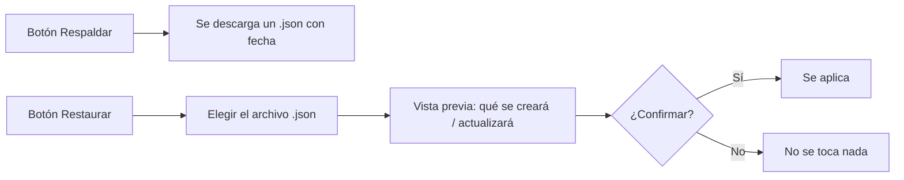
```mermaid
flowchart LR
    A[Botón Respaldar] --> B[Se descarga un .json con fecha]
    C[Botón Restaurar] --> D[Elegir el archivo .json]
    D --> E[Vista previa: qué se creará / actualizará]
    E --> F{¿Confirmar?}
    F -- Sí --> G[Se aplica]
    F -- No --> H[No se toca nada]
```

> ℹ️ **Nota** — esto se guarda en tu propia computadora, así que sobrevive a cualquier problema del hosting. Se complementa con el respaldo automático del servidor.

---

# 🔒 Parte 3 — Seguridad

## Verificación en dos pasos (2FA) — `admin/seguridad.html`

Añade una segunda capa además de tu contraseña: un código de 6 dígitos que cambia cada 30 segundos, generado por una app como Google Authenticator o Authy.

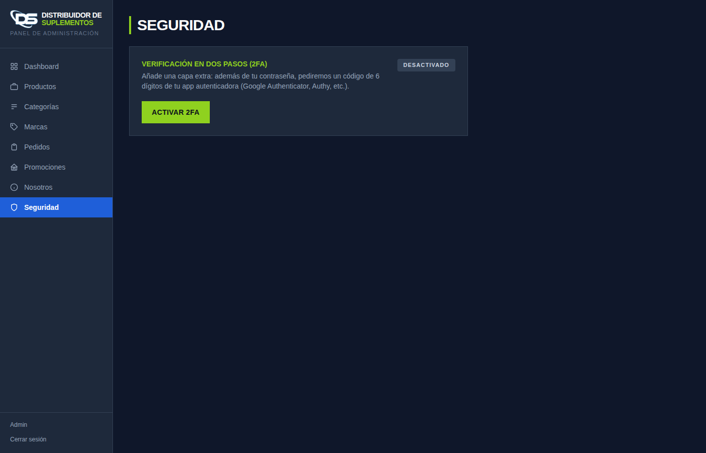

### Cómo activarla

1. Pulsa **"Activar 2FA"** — aparece una clave secreta (o un enlace) para escanear/copiar en tu app autenticadora.

   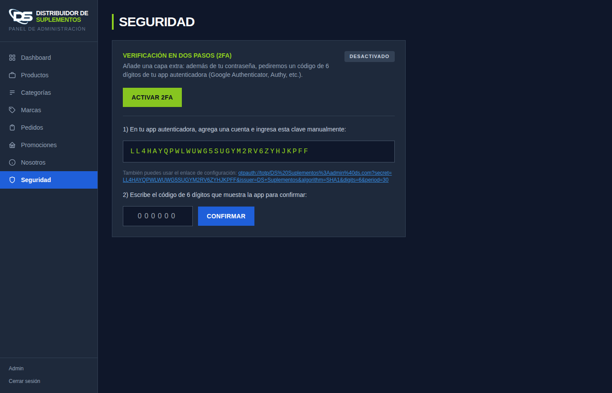

2. Escribe el código de 6 dígitos que te muestra la app y pulsa **"Confirmar"**.
3. El 2FA queda activo y se muestran tus **códigos de recuperación** — cada uno sirve una sola vez si alguna vez pierdes el teléfono. **Guárdalos en un lugar seguro: solo se muestran esta vez.**

   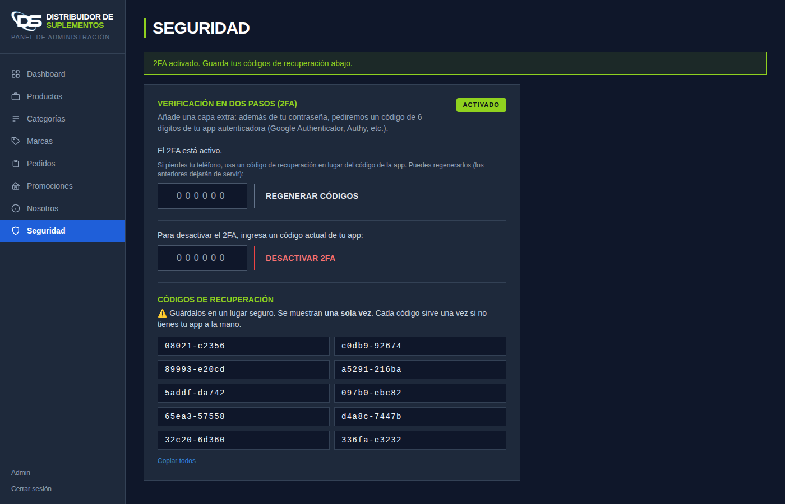

4. Desde ese momento, cada vez que inicies sesión en el panel te pedirá, además de tu correo y contraseña, el código de 6 dígitos.

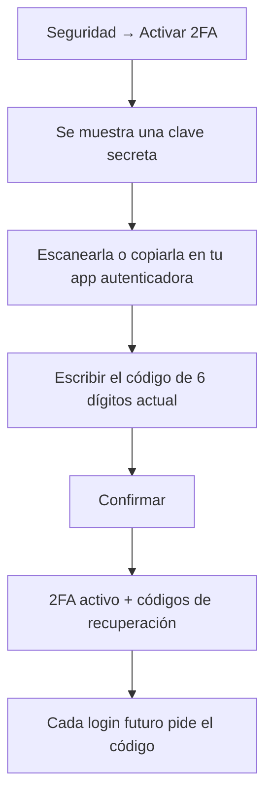
```mermaid
flowchart TD
    A[Seguridad → Activar 2FA] --> B[Se muestra una clave secreta]
    B --> C[Escanearla o copiarla en tu app autenticadora]
    C --> D[Escribir el código de 6 dígitos actual]
    D --> E[Confirmar]
    E --> F[2FA activo + códigos de recuperación]
    F --> G[Cada login futuro pide el código]
```

### Si pierdes tu teléfono

Usa uno de los **códigos de recuperación** guardados en el paso 3, en vez del código de la app. Cada uno solo sirve una vez.

### Regenerar o desactivar

Desde la misma pantalla, con 2FA activo, puedes **regenerar los códigos de recuperación** (invalida los anteriores) o **desactivar el 2FA por completo** — ambas acciones piden un código válido de tu app como confirmación.

> ℹ️ **Nota sobre auditoría** — el sistema sí guarda internamente un registro de qué acción hizo cada administrador y cuándo (para investigar un problema si hiciera falta), pero **no hay ninguna pantalla en el panel para consultarlo** — es una función técnica de respaldo, no un botón que puedas usar tú desde la interfaz.

---

# 📎 Apéndice

## Identidad visual de la marca

| | Color | Uso |
|---|---|---|
| ⬛ | `#0B0F1A` — Ink | Fondos oscuros, texto principal |
| 🟦 | `#1F5FD9` — Brand | Acentos, enlaces, botones primarios |
| 🟩 | `#8FD11F` — Lime | Botones de acción, resaltados |
| ⬜ | `#F7F8FA` — Paper | Fondo claro del storefront |
| 🟥 | `#BA1A1A` — Error | Alertas, avisos de cuidado |
| 🟦 | Escala `cobalt` (panel admin) | Enlaces y acentos en el panel |

**Tipografías:** títulos en **Barlow Condensed** (600/700/800), texto en **Barlow** (400/500/600/700). Íconos con **Material Symbols Outlined**.

## Glosario

| Término | Significado |
|---|---|
| **SKU** | Código único de un producto. Permite reimportar el CSV sin duplicar aunque cambie el nombre. |
| **Sin control de inventario** | El stock (de un producto o de un sabor) está vacío: siempre se muestra disponible, nunca se descuenta. |
| **Agotado** | Stock en `0`: no se puede comprar. Con sabores, el producto solo se ve agotado si TODOS lo están. |
| **Sabor** | Variante de un producto con su propio stock y/o precio opcional. |
| **Vista previa (Analizar)** | Simulación de la importación de CSV que muestra qué cambiaría, sin escribir nada todavía. |
| **Reemplazar todo** | Modo del importador que desactiva (no borra) los productos ausentes del CSV. |
| **2FA** | Verificación en dos pasos: contraseña + código de 6 dígitos de una app autenticadora. |
| **Respaldo** | Archivo descargable con los datos de una sección, para restaurarlos si algo sale mal. |

## Mapa completo de páginas

| Zona | Página | Para qué sirve |
|---|---|---|
| Tienda | `index.html` | Portada + carrusel de promociones + destacados |
| Tienda | `catalogo.html` | Catálogo con buscador inteligente, filtros y favoritos |
| Tienda | `producto.html` | Ficha de un producto: sabores, galería, agregar al carrito |
| Tienda | `marcas.html` | Directorio de marcas |
| Tienda | `nosotros.html` | Información de la tienda + contacto por WhatsApp |
| Tienda | `pedido.html` | Carrito (líneas por producto+sabor) + checkout |
| Cliente | `registro.html` | Crear una cuenta |
| Cliente | `login.html` | Iniciar sesión |
| Cliente | `recuperar.html` / `restablecer.html` | Recuperar contraseña olvidada |
| Cliente | `cuenta.html` | Mis datos, pedidos, favoritos y direcciones |
| Admin | `admin/login.html` | Entrada al panel (con 2FA si está activo) |
| Admin | `admin/index.html` | Dashboard: métricas + últimos pedidos + respaldo completo |
| Admin | `admin/productos.html` | Productos: CRUD + SKU + sabores + galería + importar/exportar CSV |
| Admin | `admin/categorias.html` | Categorías: CRUD |
| Admin | `admin/marcas.html` | Marcas: CRUD + importar CSV |
| Admin | `admin/pedidos.html` | Ver pedidos y cambiar su estado |
| Admin | `admin/promociones.html` | Carrusel de la portada: CRUD |
| Admin | `admin/nosotros.html` | Editar la página pública "Nosotros" |
| Admin | `admin/seguridad.html` | Activar/gestionar el 2FA |
